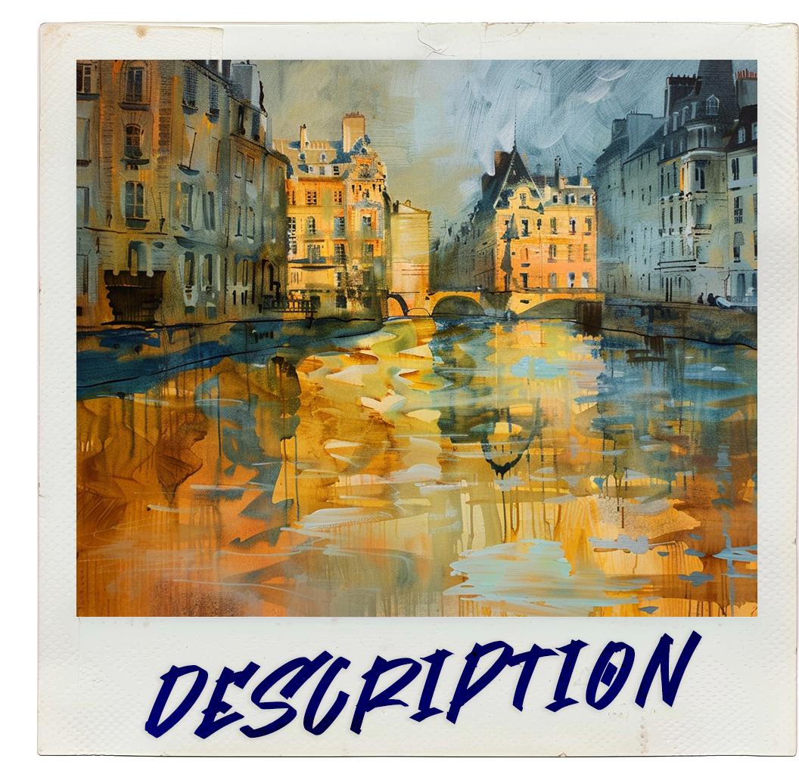

Guidivière's name originates from two old vierian words, "Guide" meaning gold and "Vière" meaning river. The birthplace of Guidivière, Gran Vière, is famous for it's flowing golden river that cuts through its capital city and surrounding settlements. It's known for being quite an expansionist industrialized nation, home of artisans, merchants and adventurers.

# Location
The Guidivière nation spans many different archipelagos

