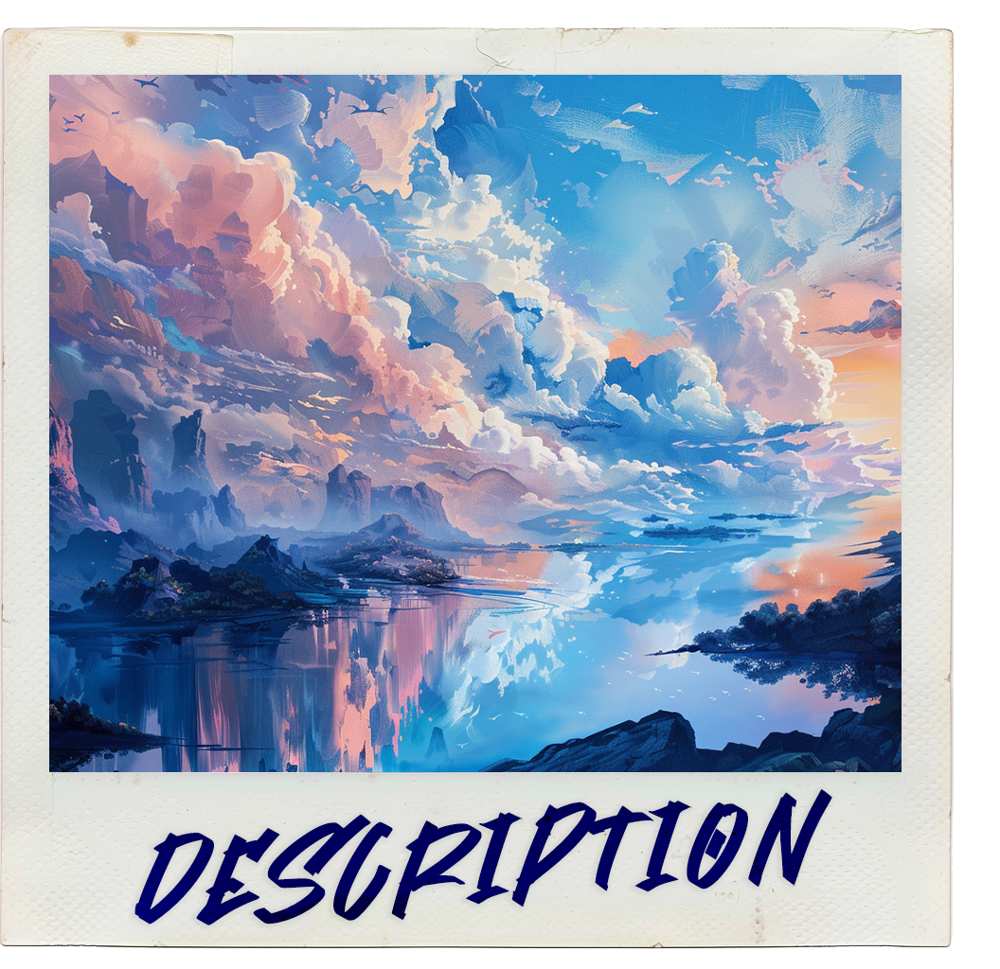
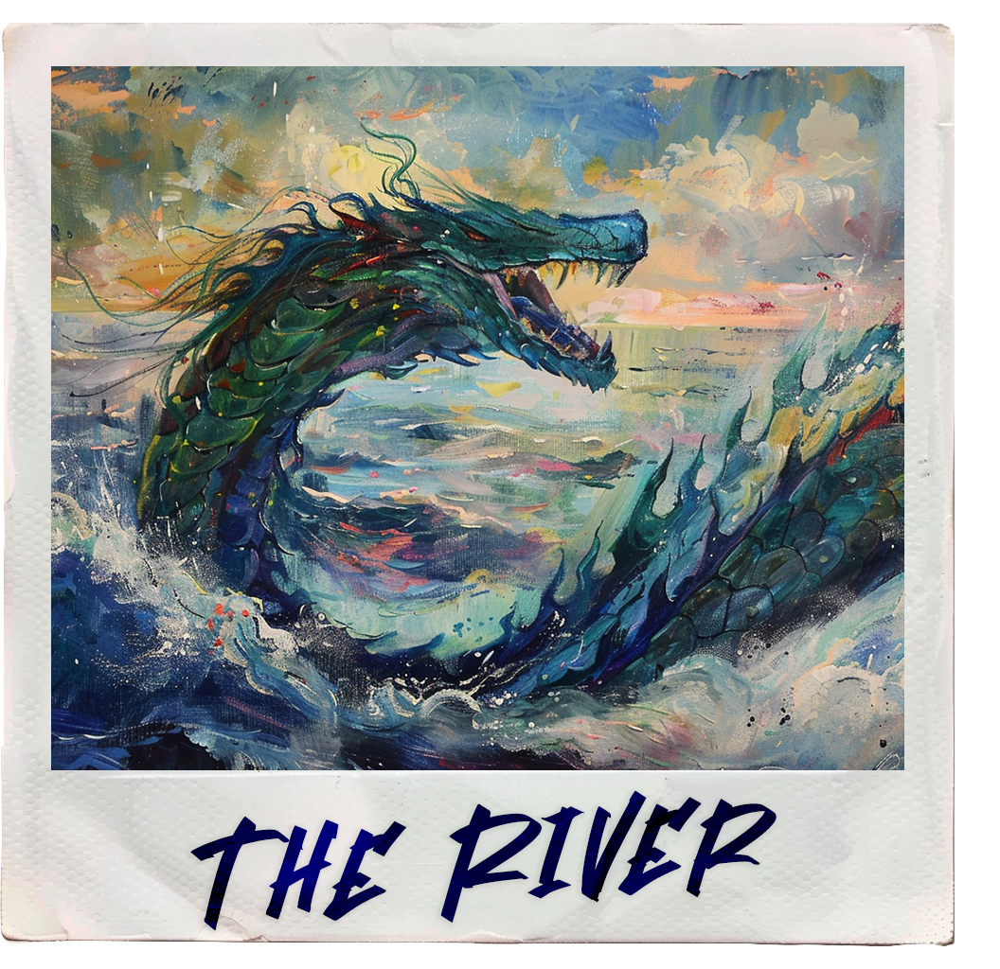
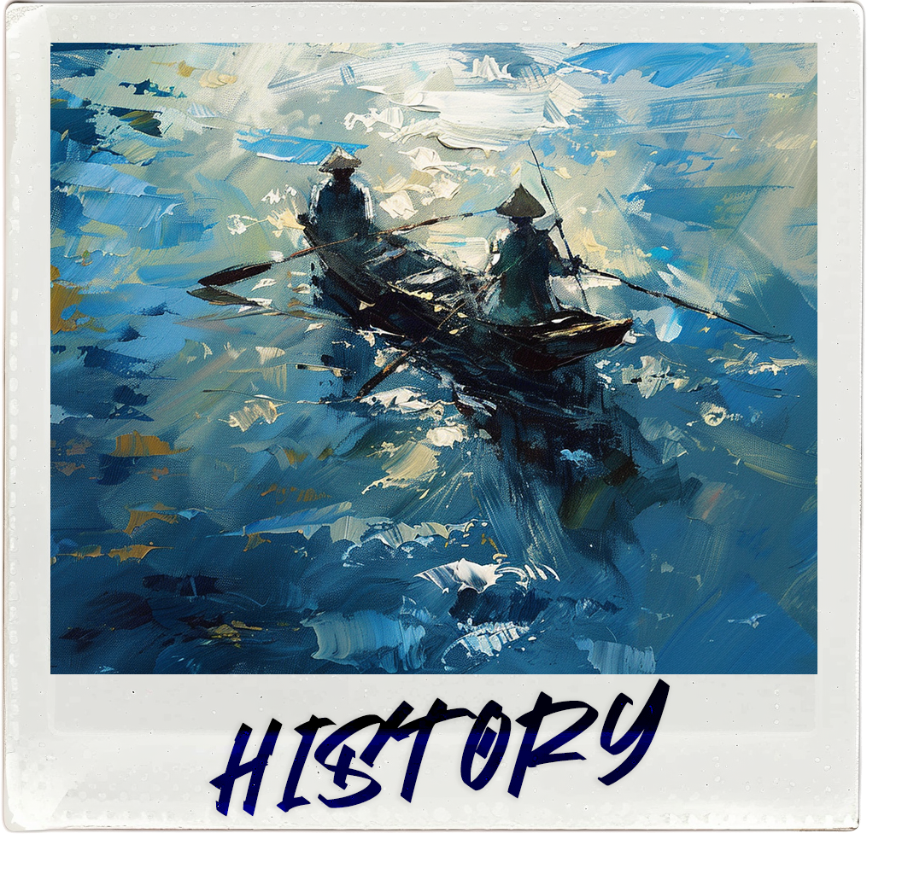

The Leviathan River is the largest river in all of Grand Cumulus.

It spans all the way across the region, from the eastern boundary (near the Xenian Isle) to the western boundary (near the Syzlaw archipelago), winding its way through many other isles and archipelagos, serving as one of the most important cultural landmarks in all the region.

# Geography

The river is about 5 km deep and 4 km wide, encapsulating many floating isles and archipelagos like the Águafina archipelago and some parts of Guidivière. It is quite a snake-like river as it often loops around itself or goes back towards its origin. 

# Ecology

Since it is such a large mass of water, it is home to many water-based species such aquatic plants, algae, aquatic mammals, fish and even aquatic sentient beings like fishfolk and merfolk. Of course, other species such as birds, wyverns and many other non-aquatic lifeforms also reside in the landmasses within and around the river, using it as a hunting ground, as a source of water or even to transport themselves. 

Such a rich ecosystem can be quite affected by pollution and overfishing so be mindful of our region’s greatest river!

# History & Cultural Significance

The Leviathan River might be one of the most important landmarks to our region’s history and cultural development as it was pivotal to many civilizations that lived and thrived near it.

Specially after these cultures invented flight and started using the river for transport, fishing and even irrigation in closer isles. Nowadays, it can be even used in industry and to syphon Radiocosmological Frequencies to power our modern technologies.

It also has quite a mythological significance, it got its name from Leviathans, large and ancient river serpents that lived within the river, some cultures, specially fishfolk cultures, worshiping these beasts as gods, for example The Hunger was often depicted as a fearsome leviathan that roamed around.

Regarding legal rights to the river, it was agreed upon by nations of the Grand Cumulus that travel and use of the Leviathan River is a right to all beings in the region, however heavy industrial use that may damage the local habitats or actions that may infringe upon the rights of other surrounding nations and people are prohibited by the Commission, those caught doing these illegalities being judged in an interinsular court.