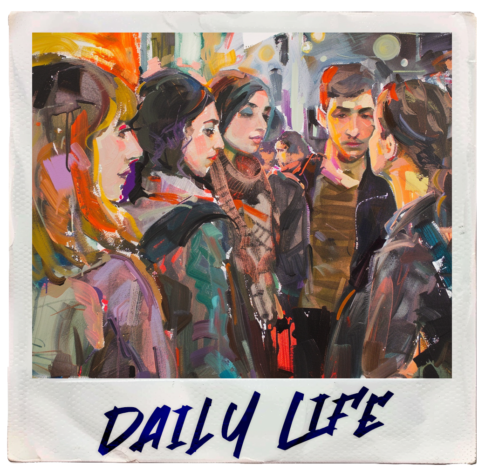

Leviathan University is the biggest university in all of the Grand Cumulus. Situated in the [Sobr'azul Isle](../world/sobrazul-isle), this university functions almost like a island-nation. It is a popular spot for students from all over the region due to the rich educational plans, fulfilling student life or centuries of history and prestige surpassed by no other university in the region.

# Location
While the [Sobr'azul](../world/sobrazul-isle) isle has about 2000km2, only about 650km2 is covered by university or general purpose land. The university buildings only cover around 1
150km2, another 500km2 of the land being used for services like accommodation, storage, resource gathering, farming and other utilities needed in running the university.  
Though the university center is where most of the educationally focused buildings are, most of the total area of the university occupied is covered by single or multipurpose buildings typically associated with on the maintenance aspect of running the university, specially you venture outside the university centers.   
For example while in the city center broader use buildings such as kindergarten to high-school schools for the local workers or accommodation, restaurants and bars for the students are more common, in the periphery agricultural, resource gathering and suburban/rural accommodation or faculties associated with the natural world such as Agricultural Studies, Biology, Geology, among others, are more common.  
The other 1350km2 are mostly covered by wilderness, forests, lakes and the [Picot](../world/mount-picot) mountain range.  

The university grounds are divided into Districts all lettered from A to Z, this was made as an effort to not segregate the different faculties too much, though some districts are generally known for their particularly popular district faculty or unique architecture, such as the G district being a very technologically minded district with more modern building designs, while in the B District is more known for its artistic or political counter cultures.

# Origins & Foundation
Leviathan University was founded on the 300th anniversary of the 187 Commission as a celebration of peace and cooperation among the island nations.  
It was decided it would be built on the [Sobr'azul isle](../world/sobrazul-isle), as it was an uninhabited and neutral island.

# Politics
As an interinsular university it always remains impartial and neutral to wider politics. During its foundation, the university was given a political status allowing it to operate autonomously within its border, being financed by states and wealthy individuals so it can be maintained in good will. It's also quite self-sufficient as most of the inhabitants work  outside of regular educational services in order to maintain it.  

Many scholarships are also given to the brightest students that pass the international exams or to students who live on far off islands in order to help them pay for transport and accommodation.  Some scholarships can also be financed in exchange for a few years of service after graduation, be it internships in companies and guilds, working in research and development laboratories inside and outside the university, work related to governments or other public offices or even military attendance.

# Laws & Rules
Student admission is made through an interinsular exam tailored to each specific course where, based on grades, previous work or even charisma and learning potential, the best students are admitted.

Weapons are generally not allowed on campus, though you can keep them stored within your private accommodation.

# Population
In 101 E.R. the current student population is around 400.000 students and 1.2 million staff members.

Around 96% of students every year come from outside the isle, meaning around 4% of students were born and raised within the university's borders.

# Economy & Commerce

Scattered throughout the university there are multiple types of commercial services be them markets, grocers, clothing stores and other retailers or more leisure oriented establishments like bars, cafés and restaurants or even arcades and pools.

As stated before, the university is mostly self-sufficient, though it still requires some imports when it comes to construction for example, most of its resources are produced inland. 

## Currency

The official currency of the Leviathan University is the Levi. The Levi was created in order to standardize the currency used by interinsular students and to facilitate commerce within the campus. 

# Transport

The major transport system of the university is a large network of trams that connect the major faculty areas, social gathering areas, residential areas and other locations of importance. There are also roads made for vehicular travel along with the trams connecting the more uninhabited areas to the center.  

Along with these larger modes of transport, flying scooters are also a popular choice among students to travel through the university campus quickly.

# Accommodation
All students are given a private room to live in until they graduate or drop out of their studies. Since there are a lot of students, residential districts are quite common and large.

 